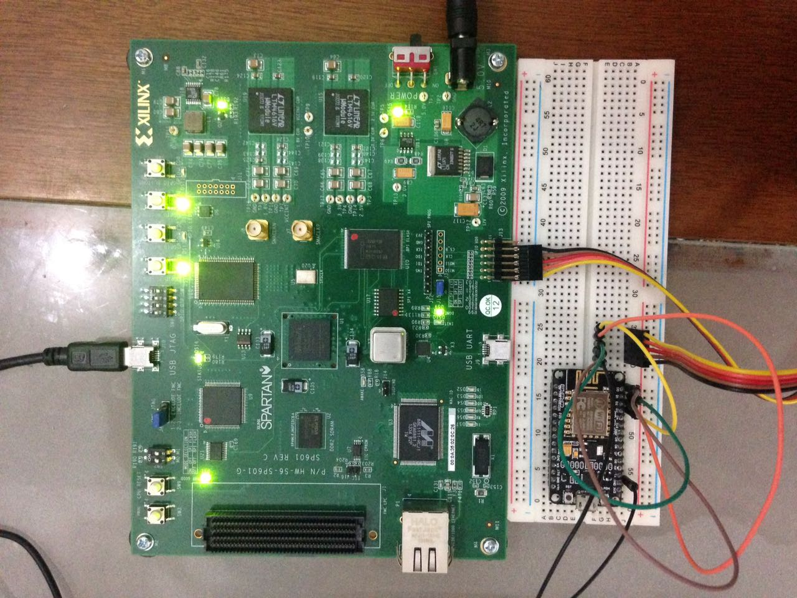

# FPGAmbiarra

## Componentes
Vai entender ¬¬
### Microcontrolador: ESP8266


### FPGA: SPARTAN 6


### Servidor: Java
```
TODO
```

### Servidor: Java
```
TODO
```

### Comunicação serial: Windows/Linux/Mac API
```
TODO
```
### Arduino code

Codigo que escaneia todos os dispositivos conectados a alguma rede e lista os MAC Address.
Se o MAC Address especificado no codigo for encontrado nessa lista, um sinal era enviado para o protoboard e acende o LED

## Requisitos
Requisitos para rodar toda a stack de coisas nesse projeto

- ISE Design
- Muita paciência
- FPGA Spartan 6 conforme a imagem acima
- Microcontrolador ESP8266 conforme a imagem acima
- Java/Spark/PostgreSQL
- Windows/Linux/Mac

## Membros

- Bruno V. Costa
- [Bruno B. Lerner](https://github.com/BrunoLerner)
- [Lucas Ricarte](https://github.com/lucasrrt)
